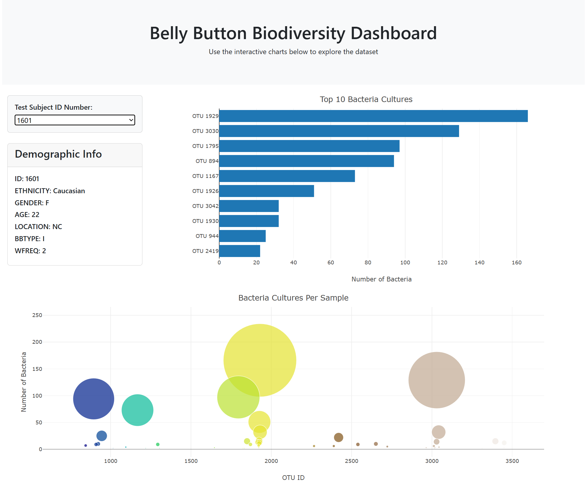

# belly-button-challenge
Module 14 Challenge:  
Built an interactive dashboard to explore the Belly Button Biodiversity dataset, which catalogs the microbes that colonize human navels.  
The dataset reveals that a small handful of microbial species (also called operational taxonomic units, or OTUs, in the study) were present in more than 70% of people, while the rest were relatively rare.
# Code Source:
index.html (interactive dashboard)  
samples.json (file provided for reference)  
app.js (web development project setup serves as the backbone of the JavaScrip codebase)
# Bar Chart
1. Used the D3 library to read in samples.json from the URl https://static.bc-edx.com/data/dl-1-2/m14/lms/starter/samples.json.  
2. Created a horizontal bar chart with a dropdown menu to display the top 10 OTUs found in that individual:  
- Used sample_values as the values for the bar chart.  
- Used otu_ids as the labels for the bar chart.  
- Used otu_labels as the hovertext for the chart.
# Bubble Charts
3. Created a bubble chart that displays each sample:  
- Used otu_ids for the x values.  
- Used sample_values for the y values.  
- Used sample_values for the marker size.  
- Used otu_ids for the marker colors.  
- Used otu_labels for the text values.
# Metadata and Deployment
4. Displayed the sample's metadata, an individual's demograpic information.  
- Loop through each key-value pair from the metadata JSON object and create a text string.  
- Appended an html tag with that text to the #sample-metadata panel.  

5. Updated all the plots when a new sample is selected.  
6. Deployed the app for a free static page hosting service in GitHub Pages. 
# References:
Hulcr, J. et al. (2012) A Jungle in There: Bacteria in Belly Buttons are Highly Diverse, but Predictable. Retrieved from: http://robdunnlab.com/projects/belly-button-biodiversity/results-and-data/.  
Guidance on d3, JavaScrip filter, and GitHub Pages was sourced from theXpert Learning Assistant Chat+, an AI Learning tool for EdX.  
Used plotly | Graphing Libraries for bubble chart and horizontal bar chart in Java Scrip, accessed March 2025.